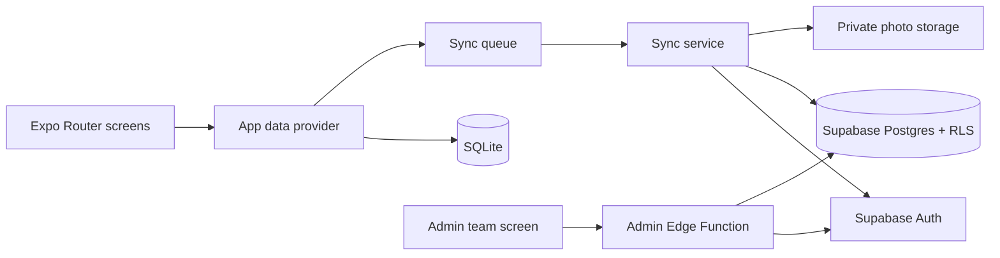

# FlowPilot Mobile

FlowPilot is a private, offline-first student record app for schools and field
teams. It lets authorized staff capture student details quickly, keep working
without a reliable connection, and sync approved records to a protected
Supabase backend when connectivity returns.

> **Project status:** Private pilot. The core record, access, export, and
> push-sync workflows are implemented. Review the production checklist before
> using real student data or submitting the app to a public store.

## Why FlowPilot

School enrollment and field-data collection often happen where Wi-Fi is slow,
mobile data is expensive, or several staff members share a short collection
window. A cloud-only form can lose work at exactly the wrong moment.

FlowPilot writes each record to on-device SQLite first. The user gets an
immediate save result, while a durable outbox tracks the work that still needs
to reach Supabase. This keeps data entry responsive and makes sync status
visible instead of hiding network failures.

## What It Does

- Captures student identity, contact, guardian, school, class, academic year,
  notes, record date, and photo information.
- Supports school-specific custom fields with required-field validation.
- Saves records locally before attempting network sync.
- Shows pending, syncing, synced, and failed queue states with retry feedback.
- Browses, searches, filters, edits, and soft-deletes local student records.
- Reviews records collected on a selected day.
- Exports an individual record to PDF and daily lists to PDF or CSV.
- Protects the app with invitation-only email/password or Google authentication.
- Lets organization admins invite staff, assign roles, revoke invitations, and
  remove accounts.
- Enforces organization access in Postgres with Row Level Security.

## Typical Workflow

1. An organization owner invites a staff member's exact email address.
2. The staff member signs in with Google or registers the invited email.
3. The user selects a school, academic year, and class.
4. A student record is validated and committed to SQLite immediately.
5. The matching operation is added to the local sync queue.
6. **Sync now** pushes eligible queue items to Supabase in dependency order.
7. Staff can inspect failures, retry them, and export records when needed.

## Architecture



The app is local-first, with the current cloud flow focused on pushing queued
device changes to Supabase. Full server-to-device pull sync and multi-device
conflict resolution are roadmap work.

## Technology

| Layer | Technology | Why it is used |
| --- | --- | --- |
| Mobile and web | Expo 57, React Native 0.86, React 19 | One TypeScript codebase for iOS, Android, and web previews |
| Navigation | Expo Router | File-based routes and protected route groups |
| Local data | Expo SQLite | Fast, durable offline writes and a persistent sync outbox |
| Forms | React Hook Form and Zod | Predictable field state and user-facing validation |
| Cloud | Supabase Auth, Postgres, Storage, Edge Functions | Managed identity, relational data, private media, and privileged admin actions |
| Authorization | Postgres RLS and organization memberships | Server-enforced tenant isolation independent of the client UI |
| Session storage | Expo SecureStore on native | Encrypted native token storage and a bounded offline access lease |
| Exports | Expo Print, File System, and Sharing | Native PDF/CSV generation and share-sheet support |
| Testing | Jest and React Native Testing Library | Coverage for validation, dates, exports, and sync retry rules |

## Access And Security

- Registration is invitation-only and checks the normalized email before a
  Supabase Auth user is created.
- The mobile bundle contains only the Supabase URL and publishable key. The
  Supabase secret/service-role key remains inside the deployed Edge Function.
- Cloud reads and writes are authorized by Row Level Security, not by hidden UI.
- Roles include `STAFF`, `SCHOOL_ADMIN`, and `ORG_ADMIN`.
- The last organization owner cannot be removed or demoted.
- Native sessions use SecureStore. Membership is rechecked periodically and
  when the app returns to the foreground.
- Photos use a private storage bucket. The app includes no advertising,
  analytics, face recognition, or tracking SDK.
- Team access changes are written to an audit log.

See [Production Access](docs/PRODUCTION_ACCESS.md) for the owner bootstrap,
Auth hook, Google OAuth, invitations, redirects, SMTP, and release checklist.

## Quick Start

### Prerequisites

- Node.js 22.13 or newer
- npm
- Xcode for local iOS builds or Android Studio for local Android builds
- A Supabase project when authentication and cloud sync are required

### Install And Run

```sh
nvm install
nvm use
npm install
cp .env.example .env
npm run typecheck
npm test
npm run start
```

Fill `.env` with the project's public values before testing cloud features:

```dotenv
EXPO_PUBLIC_SUPABASE_URL=https://your-project.supabase.co
EXPO_PUBLIC_SUPABASE_PUBLISHABLE_KEY=your-publishable-key
EXPO_PUBLIC_PERSIST_WEB_SQLITE=0
```

Never place a Supabase secret/service-role key in an `EXPO_PUBLIC_` variable.

The web preview uses in-memory SQLite by default to avoid browser file locking.
Use a native development build to verify persistent offline behavior, camera
capture, SecureStore, sharing, and App Store behavior.

## Supabase Setup

```sh
supabase login
supabase link --project-ref <project-ref>
supabase db push --include-seed
supabase functions deploy admin-members
supabase secrets set FLOWPILOT_APP_REDIRECT_URL=flowpilot://accept-invite
```

After deployment, bootstrap the first owner and enable the invitation hook by
following [Production Access](docs/PRODUCTION_ACCESS.md). Do not enable the hook
before the first owner email has been bootstrapped.

## Useful Commands

| Command | Purpose |
| --- | --- |
| `npm run start` | Start the Expo development server |
| `npm run ios` | Open the Expo iOS development flow |
| `npm run android` | Open the Expo Android development flow |
| `npm run web` | Start the browser preview |
| `npm run lint` | Run ESLint |
| `npm run typecheck` | Validate TypeScript without emitting files |
| `npm test` | Run the Jest suite serially |

## Project Structure

```text
app/                         Expo Router screens and protected routes
src/components/              Shared operational UI components
src/database/                SQLite schema, seed, and repositories
src/features/auth/           Sign-in, OAuth, invitation, and reset flows
src/features/admin/          Organization membership administration
src/features/sync/           Queue processing, retry policy, remote payloads
src/features/media/          Camera, gallery, compression, and upload helpers
src/features/exports/        PDF and CSV generation
src/hooks/                   Auth and application data providers
src/validation/              Zod schemas and form contracts
supabase/migrations/          Postgres schema, RLS, invitations, and hooks
supabase/functions/           Privileged account-management Edge Function
docs/                        Architecture, privacy, setup, and deployment notes
```

## iOS Demo And Distribution

For a free 7-day build on your own iPhone, remote friend installation, or a
TestFlight beta, follow [iOS 7-Day Demo](docs/IOS_7_DAY_DEMO.md). The short
version is:

- **Free and in person:** use an Xcode Personal Team; the provisioning expires
  after 7 days and the app must be rebuilt.
- **Install on a friend's phone:** use a paid Apple Developer membership with
  EAS internal distribution or TestFlight.
- **Temporary public beta:** use TestFlight and expire the build after 5 to 7
  days. A public App Store release is unnecessary for this kind of demo.

## Current Limits

- Sync currently pushes the local queue; it does not yet pull all remote
  changes or resolve concurrent edits from multiple devices.
- Browser SQLite persistence is intentionally off by default.
- Production SMTP, monitoring, backups, support URLs, store artwork, and legal
  privacy/retention text still require deployment-specific configuration.
- A public iOS submission may require Sign in with Apple or documentation that
  the education/business account exception applies.
- App Store account creation requires an in-app account-deletion initiation
  flow; administrator removal alone may not satisfy review.
- Real school and student data should not be used until the production security,
  privacy, retention, backup, and device testing checklist is complete.

## AI Assistant Roadmap

FlowPilot does **not** currently include an AI chatbot or autonomous agent. A
future assistant could help administrators draft custom-field templates,
summarize non-sensitive operational totals, flag possible duplicate records,
and explain sync failures. Any such feature should be opt-in, auditable, and
designed so student names, photos, contact details, and other personally
identifiable information are not sent to a model by default.

## Roadmap

- Two-way incremental sync and explicit conflict resolution
- Sign in with Apple and in-app self-service account deletion
- Production email delivery, monitoring, backups, and error reporting
- Separate development, staging, and production Supabase projects
- Accessibility audit and real-device iOS/Android test matrix
- Store-ready icon, splash screen, screenshots, privacy labels, and support site
- Privacy-preserving administrative assistant after the data boundary is defined

## Documentation

- [Architecture](docs/ARCHITECTURE.md)
- [Database](docs/DATABASE.md)
- [Offline Sync](docs/OFFLINE_SYNC.md)
- [Production Access](docs/PRODUCTION_ACCESS.md)
- [Deployment](docs/DEPLOYMENT.md)
- [iOS 7-Day Demo](docs/IOS_7_DAY_DEMO.md)
- [Privacy](docs/PRIVACY.md)
- [Implementation Steps](docs/IMPLEMENTATION_STEPS.md)

## Data Responsibility

Student records are sensitive. Deploying organizations are responsible for
appropriate consent, least-privilege access, retention and deletion rules,
incident response, and compliance with the laws and school policies that apply
in their jurisdiction.
